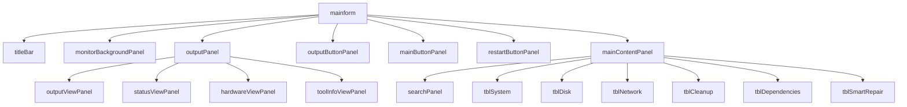

# Geografische Aufteilung der Panels

Diese Datei enthält eine Übersicht über die Panels in der `mainform`, einschließlich ihrer Position und Größe.

## Panels

### 1. `$titleBar`
- **Position:** Nicht explizit gesetzt (Dock: `Top`)
- **Größe:** `1000 x 30`
- **Beschreibung:** Benutzerdefinierte Titelleiste

### 2. `$monitorBackgroundPanel`
- **Position:** `(0, 30)`
- **Größe:** `1000 x 85`
- **Beschreibung:** Hintergrund-Panel für die Hardware-Monitore

### 3. `$gbCPU`
- **Position:** `(1, 35)`
- **Größe:** `340 x 75`
- **Beschreibung:** Panel für CPU-Informationen

### 4. `$outputPanel`
- **Position:** Nicht explizit gesetzt (Dock: `Fill`)
- **Beschreibung:** Übergeordnetes Panel, das mehrere Ausgabe-Panels enthält

### 5. `$outputViewPanel`
- **Position:** Nicht explizit gesetzt (Dock: `Fill`)
- **Sichtbarkeit:** Standardmäßig sichtbar (`Visible = $true`)
- **Beschreibung:** Panel für die Standard-Ausgabe

### 6. `$statusViewPanel`
- **Position:** Nicht explizit gesetzt (Dock: `Fill`)
- **Sichtbarkeit:** Standardmäßig verborgen (`Visible = $false`)
- **Beschreibung:** Panel für Statusinformationen

### 7. `$hardwareViewPanel`
- **Position:** Nicht explizit gesetzt (Dock: `Fill`)
- **Sichtbarkeit:** Standardmäßig verborgen (`Visible = $false`)
- **Beschreibung:** Panel für Hardwareinformationen

### 8. `$toolInfoViewPanel`
- **Position:** Nicht explizit gesetzt (Dock: `Fill`)
- **Sichtbarkeit:** Standardmäßig verborgen (`Visible = $false`)
- **Beschreibung:** Panel für Tool-Informationen

### 9. `$outputButtonPanel`
- **Position:** `(3, 125)`
- **Größe:** `225 x 45`
- **Beschreibung:** Panel für die Ausgabe-Buttons

### 10. `$mainButtonPanel`
- **Position:** `(3, 175)`
- **Größe:** `217 x 445`
- **Beschreibung:** Vertikales Panel für die Hauptnavigation

### 11. `$restartButtonPanel`
- **Position:** `(3, 630)`
- **Größe:** `217 x 190`
- **Beschreibung:** Panel für den Neustart-Button

### 12. `$mainContentPanel`
- **Position:** `(220, 125)`
- **Größe:** `775 x 48`
- **Beschreibung:** Panel für die Hauptinhalte

### 13. `$searchPanel`
- **Position:** `(10, 0)` (innerhalb von `$mainContentPanel`)
- **Größe:** `775 x 48`
- **Beschreibung:** Panel für das Suchfeld

### 14. `$global:tblSystem`
- **Position:** `(0, 0)` (innerhalb von `$mainContentPanel`)
- **Größe:** `735 x 230`
- **Beschreibung:** Panel für Systeminformationen

### 15. `$tblDisk`
- **Position:** `(0, 0)` (innerhalb von `$mainContentPanel`)
- **Größe:** `735 x 230`
- **Beschreibung:** Panel für Festplatteninformationen

### 16. `$tblNetwork`
- **Position:** `(0, 0)` (innerhalb von `$mainContentPanel`)
- **Größe:** `735 x 230`
- **Beschreibung:** Panel für Netzwerkinformationen

### 17. `$tblCleanup`
- **Position:** `(0, 0)` (innerhalb von `$mainContentPanel`)
- **Größe:** `735 x 230`
- **Beschreibung:** Panel für Bereinigungsinformationen

### 18. `$global:tblDependencies`
- **Position:** `(0, 0)` (innerhalb von `$mainContentPanel`)
- **Größe:** `735 x 230`
- **Beschreibung:** Panel für Abhängigkeitsprüfungen

### 19. `$global:tblSmartRepair`
- **Position:** `(0, 0)` (innerhalb von `$mainContentPanel`)
- **Größe:** `735 x 38`
- **Beschreibung:** Panel für die Smart-Repair-Funktion

## Diagramm der Panel-Struktur

Das folgende Diagramm zeigt die hierarchische Struktur der Panels in der `mainform`:

